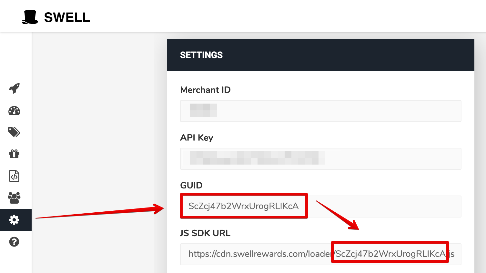

# nacelle-swell-nuxt-module

Adds Vue.js components for integrating [Swell](https://www.swellrewards.com/) loyalty and referrals in your [Nacelle](https://getnacelle.com/) Nuxt project.

## Requirements

* A Nacelle project set up locally. See https://docs.getnacelle.com for getting started.
* A Swell app installed and setup on your Shopify store.

## Setup

### Add Module to Nacelle

Once you hace Nacelle and Swell set up you can install this module in your project from `npm`:

```
npm install @nacelle/nacelle-swell-nuxt-module --save
```

After the package has installed, open `nuxt.config.js`. Under `modules` add `@nacelle/nacelle-swell-nuxt-module` to the array. It should look something like this:

```
modules: [
  '@nuxtjs/pwa',
  '@nuxtjs/dotenv',
  '@nacelle/nacelle-nuxt-module',
  '@nuxtjs/sitemap',
  '@nacelle/nacelle-swell-nuxt-module'
],
```

Then add your Swell GUID to your environment variables `.env` file.
[](./swell_settings_guid.png)
```
SWELL_GUID=xxxxxxxxxxxxx
```

### Add the components to your Nacelle Storefront

To make the Swell widget visible in your store, open up `layouts/default.vue` and paste `<swell-widget />` just before the closing `div` in the template.

### Shopify Setup

To complete the integration a liquid snippet needs to be added to your Shopify theme.

Open your Shopify theme code editor under "Actions > Edit Code". Under "Snippets" click "Add new snippet". Name the snippet `swell-nacelle-init.liquid`, paste the following code found [here](liquid/swell-nacelle-init.md).

Open `layout/theme.liquid` and and before the closing `body` tag paste ``. Your Shopify account pages will now set the correct Swell data to be used in your Nacelle store.
