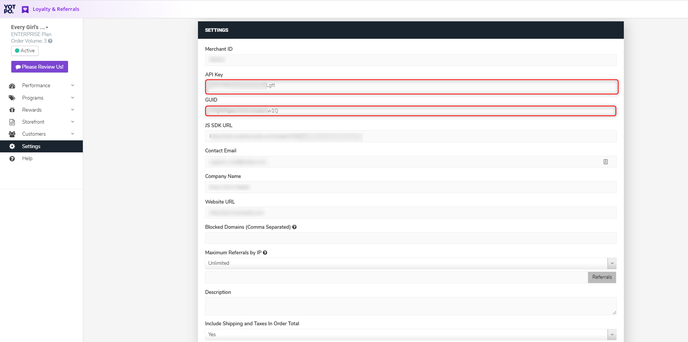

# [DEPRECATED]

This package is deprecated. To integrate a third party script with your Nuxt project, follow our docs here: https://docs.getnacelle.com/nuxt/external-scripts.html
# Nacelle Yotpo Loyalty

Adds Vue.js components for integrating [Yotpo](https://www.yotpo.com/platform/loyalty/) loyalty and referrals in your [Nacelle](https://getnacelle.com/) Nuxt project.

## Requirements

- A Nacelle project set up locally. To get started, refer to [the Nacelle docs](https://docs.getnacelle.com).
- A Yotpo app installed and setup on your Shopify store.

## Setup

### Install

Once you have Nacelle and Yotpo set up you can install this module in your project from `npm`:

```
npm install @nacelle/nacelle-yotpo-loyalty --save
```

### `.env`

Next, add your Yotpo GUID to your environment variables `.env` file.
[](./yotpo_settings_guide.png)

```
# .env

YOTPO_GUID=xxxxxxxxxxxxx
```

### `nuxt.config.js`

In the `modules` block of `nuxt.config.js`, add `@nacelle/nacelle-yotpo-loyalty` to the array:

```javascript
modules: [
  // ...other modules,
  '@nacelle/nacelle-yotpo-loyalty'
],
```

Also in `nuxt.config.js`, add the environment variable to the `nacelle` block:

```javascript
// nuxt.config.js
nacelle: {
  // ...other Nacelle config
  yotpoGUID: process.env.YOTPO_GUID
},
```

### Add the components to your Nacelle Storefront

To make the Yotpo widget visible in your store, open up `layouts/default.vue` and paste `<yotpo-widget />` just before the closing `div` in the template.

### Shopify Setup

To complete the integration a liquid snippet needs to be added to your Shopify theme.

Open your Shopify theme code editor under "Actions > Edit Code". Under "Snippets" click "Add new snippet". Name the snippet `yotpo-nacelle-init.liquid`, paste the following code found [here](liquid/yotpo-nacelle-init.md).

Open `layout/theme.liquid` and and before the closing `body` tag paste ``. Your Shopify account pages will now set the correct Yotpo data to be used in your Nacelle store.
